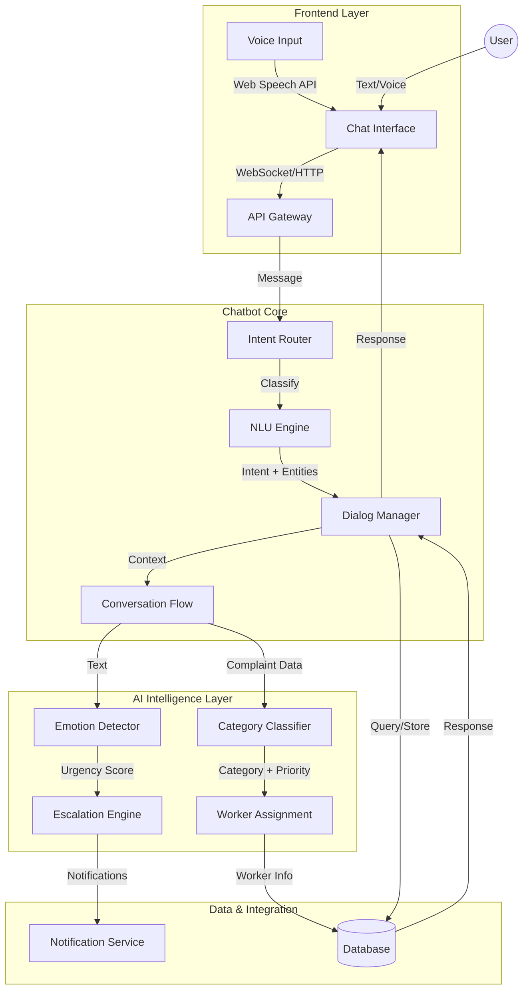
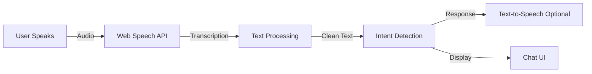

# AI-Powered Chatbot - System Objective Document
**Smart Complaint Management System**

---

## 📋 Executive Summary

This document defines the comprehensive objective, architecture, and implementation strategy for an **AI-Powered Chatbot** integrated into the Smart Complaint System. The chatbot serves as an intelligent, conversational interface that enhances user experience through natural language processing, emotion detection, and automated complaint management.

**Project Status**: Step 1 - Objective Definition  
**Last Updated**: February 11, 2026  
**Version**: 1.0

---

## 🎯 Core Objective

Build a **modular, scalable, and professional AI-powered chatbot** that:

### Primary Goals:
1. ✅ **Natural Interaction** - Engage users in human-like conversations
2. ✅ **Complaint Registration** - Allow users to file complaints through chat
3. ✅ **Status Checking** - Provide real-time complaint status updates
4. ✅ **Emotion Detection** - Identify urgency and sentiment in user messages
5. ✅ **Smart Escalation** - Automatically escalate urgent/critical cases
6. ✅ **Multi-Modal Input** - Support both text and voice interactions

### Design Principles:
- **Modularity** - Independent, reusable components
- **Scalability** - Handle growing user base and complexity
- **Professional** - Production-ready code quality
- **User-Centric** - Intuitive and helpful experience
- **Intelligent** - Context-aware and adaptive responses

---

## 🏗️ System Architecture

### High-Level Architecture



### Component Breakdown

#### 1. **Frontend Layer**
- **Chat Interface** (`templates/chatbot.html`)
  - Real-time messaging UI
  - Message bubbles (user/bot)
  - Typing indicators
  - Quick reply buttons
  - Emoji support
  
- **Voice Input Module** (`static/js/voice-handler.js`)
  - Web Speech API integration
  - Speech-to-text conversion
  - Audio waveform visualization
  - Microphone controls

#### 2. **Chatbot Core** (`ai_engine/chatbot.py`)
- **Intent Router**
  - Pattern matching (regex-based)
  - Intent classification
  - Confidence scoring
  
- **NLU Engine** (Natural Language Understanding)
  - Entity extraction (category, location, priority)
  - Keyword detection
  - Context extraction
  
- **Dialog Manager**
  - Session management
  - Context tracking
  - State management (greeting → collecting → confirming → completed)
  - Multi-turn conversations

#### 3. **AI Intelligence Layer**
- **Emotion Detector** (`ai_engine/emotion.py`)
  - Sentiment analysis (TextBlob/VADER)
  - Urgency detection
  - Frustration/anger identification
  - Polarity scoring (-1 to +1)
  
- **Category Classifier** (`ai_service.py`)
  - Complaint categorization
  - Priority assignment
  - Location extraction
  
- **Escalation Engine**
  - Urgency-based escalation
  - Multi-factor scoring
  - Auto-routing to supervisors

- **Worker Assignment** (`ai_engine/allocation.py`)
  - Skill matching
  - Load balancing
  - Zone-based assignment

#### 4. **Integration Layer**
- **Database Interface** (`database.py`)
  - Complaint storage
  - Chat history logging
  - User context retrieval
  
- **Notification Service**
  - Real-time alerts
  - Email notifications (future)
  - SMS alerts (future)

---

## 🧠 Chatbot Capabilities

### 1. Natural Language Interaction

**Intent Recognition:**
```python
Supported Intents:
├── greeting           # "Hi", "Hello", "Good morning"
├── complaint_new      # "I have an issue", "File complaint"
├── complaint_status   # "Check my complaint", "Where is my ticket"
├── help               # "Help me", "What can you do"
├── thanks             # "Thank you", "Thanks"
├── goodbye            # "Bye", "See you later"
└── unknown            # Fallback handling
```

**Conversation Flow Example:**
```
User: "Hi there"
Bot:  👋 Hello! I'm your Smart Complaint Assistant. How can I help you today?
      [File a new complaint] [Check complaint status] [I need help]

User: "My hostel room fan is broken and making loud noise"
Bot:  I understand you want to report: **Hostel Room Fan Issue**
      
      📋 Details I detected:
      - Category: Electrical
      - Priority: Medium
      - Location: Hostel Room
      
      Would you like me to submit this complaint?
      [Yes, submit it] [No, let me edit] [Cancel]

User: "Yes"
Bot:  ✅ Complaint #1247 submitted successfully!
      Your issue has been assigned to Electrical Team (Worker: John Doe)
      You'll receive updates via notifications.
```

### 2. Complaint Registration

**Automated Data Extraction:**
```python
Input:  "There's a water leak in Lab-3, very urgent!"

Extracted:
├── Title: "Water leak in Lab-3"
├── Description: "There's a water leak in Lab-3, very urgent!"
├── Category: "Plumbing" (AI-detected)
├── Priority: "High" (keyword: urgent)
├── Location: "Lab-3" (extracted)
├── Urgency: "high_urgency" (urgent + leak)
├── Worker Assignment: Auto-assigned to nearest plumber
└── Source: "chatbot"
```

**Multi-Turn Conversation Support:**
```
Bot: "What's the issue you're facing?"
User: "The AC is not working"
Bot: "Where is this AC located?"
User: "Classroom 204"
Bot: "How urgent is this? (Low/Medium/High)"
User: "It's really hot, quite urgent"
Bot: ✅ Complaint registered with High priority
```

### 3. Status Checking

**Query Handling:**
```python
User Queries:
├── "Check my complaint status"
├── "Where is my ticket #1234"
├── "What's the progress on my electrical issue"
└── "Show my recent complaints"

Bot Response:
├── Fetch user's complaints from DB
├── Display formatted status list
├── Offer detailed view
└── Suggest next actions
```

**Example Response:**
```
Here are your recent complaints:

**#1247** - Hostel Room Fan Issue - *In Progress*
   Assigned to: John Doe (Electrical)
   Last Update: 2 hours ago

**#1235** - WiFi Not Working - *Resolved*
   Resolved by: IT Team
   Closed: Yesterday at 3:45 PM

**#1220** - Broken Door Lock - *Pending*
   Status: Waiting for assignment

Would you like details on any specific complaint?
```

### 4. Emotion Detection

**Emotion Analysis System:**
```python
Detection Levels:
├── high_urgency       # 2+ urgent keywords detected
│   Keywords: urgent, emergency, asap, critical, danger, fire
│   
├── medium_urgency     # 1 urgent keyword detected
│   Keywords: broken, leak, problem, issue
│   
└── normal             # No urgent keywords
    Standard processing
```

**Sentiment Scoring:**
```python
Using TextBlob/VADER:
├── Polarity: -1.0 (very negative) to +1.0 (very positive)
├── Subjectivity: 0.0 (objective) to 1.0 (subjective)
└── Emotion Tags: angry, frustrated, calm, satisfied

Examples:
"The fan is broken"              → Polarity: -0.3 (mild concern)
"This is ridiculous! Fix it NOW!" → Polarity: -0.8 (high frustration)
"Thank you for the quick fix"    → Polarity: +0.7 (satisfied)
```

### 5. Smart Escalation

**Escalation Triggers:**
```python
Auto-Escalate When:
├── High Urgency Keywords (emergency, fire, danger)
├── Very Negative Sentiment (polarity < -0.6)
├── Repeated Complaints (same issue within 7 days)
├── Safety Keywords (accident, injury, hazard)
└── VIP User Status (optional)

Escalation Actions:
├── Increase Priority: Medium → High or High → Critical
├── Notify Supervisors: Real-time alerts
├── Faster Assignment: Top-priority queue
└── Log Escalation Reason: For audit trail
```

**Escalation Example:**
```
User: "There's smoke coming from the electrical panel in my room! Emergency!"

AI Detection:
├── Keywords: smoke, electrical, emergency
├── Urgency: high_urgency
├── Sentiment: -0.9 (panic)
├── Safety Risk: YES

Actions:
├── ⚠️ Auto-escalated to CRITICAL
├── 🔔 Immediate notification to Electrical Supervisor
├── 👷 Assign top-rated electrician immediately
├── 📊 Create incident report
└── 💬 Bot Response: "⚠️ URGENT! I've escalated this to emergency services.
                      An electrician has been dispatched immediately.
                      Please evacuate the room if safe to do so."
```

### 6. Multi-Modal Input (Text + Voice)

**Text Input:**
- Standard typing interface
- Rich text formatting
- File attachments (images of issue)
- Copy-paste support

**Voice Input:**
- Browser-based Web Speech API
- Real-time speech-to-text
- Multi-language support (English, Hindi)
- Audio waveform visualization
- Noise cancellation (browser-level)

**Voice Processing Pipeline:**


---

## 💾 Data Model

### Chat History Schema
```sql
CREATE TABLE chat_history (
    id INTEGER PRIMARY KEY AUTOINCREMENT,
    session_id TEXT NOT NULL,
    user_id INTEGER NOT NULL,
    message TEXT NOT NULL,           -- User's message
    response TEXT NOT NULL,          -- Bot's response
    intent TEXT,                     -- Detected intent
    emotion TEXT,                    -- Detected emotion/urgency
    created_at TIMESTAMP DEFAULT CURRENT_TIMESTAMP,
    FOREIGN KEY (user_id) REFERENCES users (id)
);
```

### Chatbot Sessions
```sql
CREATE TABLE chatbot_sessions (
    id INTEGER PRIMARY KEY AUTOINCREMENT,
    session_id TEXT UNIQUE NOT NULL,
    user_id INTEGER,
    started_at TIMESTAMP DEFAULT CURRENT_TIMESTAMP,
    last_activity TIMESTAMP DEFAULT CURRENT_TIMESTAMP,
    is_active INTEGER DEFAULT 1,
    context_data TEXT,               -- JSON: conversation context
    FOREIGN KEY (user_id) REFERENCES users (id)
);
```

### Complaint Extensions (for chatbot)
```sql
-- Additional columns in complaints table
ALTER TABLE complaints ADD COLUMN source TEXT DEFAULT 'web';
-- Values: 'web', 'chatbot', 'voice', 'api'

ALTER TABLE complaints ADD COLUMN emotion_data TEXT;
-- JSON: {polarity: -0.5, urgency: 'high', keywords: [...]}
```

---

## 🔧 Technical Stack

### Backend
```yaml
Language: Python 3.x
Framework: Flask 3.0.0
AI/NLP Libraries:
  - TextBlob 0.17.1      # Sentiment analysis
  - NLTK 3.8.1           # Text processing
  - spaCy 3.7.0          # NER (optional)
  - Pattern 3.6          # Text analytics

Database: SQLite3 (Development) / PostgreSQL (Production)
Real-time: Flask-SocketIO (optional for WebSocket)
```

### Frontend
```yaml
UI Framework: Bootstrap 5.3
JavaScript:
  - Vanilla JS           # Core logic
  - Web Speech API       # Voice input
  - Fetch API            # AJAX requests
  
Styling:
  - Custom CSS           # Chat bubbles
  - Animations           # Typing indicators
  - Responsive Design    # Mobile-friendly
```

### AI Models
```yaml
Intent Classification:
  - Rule-based (Regex)   # Current
  - ML-based (Future)    # scikit-learn, transformers

Sentiment Analysis:
  - TextBlob             # Current
  - VADER                # Alternative
  - Fine-tuned BERT      # Future enhancement

Entity Extraction:
  - Keyword matching     # Current
  - NER (spaCy)         # Future
```

---

## 📊 Conversation Flow States

### State Machine
```python
States:
├── greeting          # Initial state
├── collecting_info   # Gathering complaint details
├── confirming        # User confirmation
├── processing        # Submitting to DB
├── completed         # Transaction done
├── help_mode         # Providing assistance
└── error_handling    # Managing errors

Transitions:
greeting → collecting_info → confirming → processing → completed
   ↓           ↓               ↓             ↓
help_mode ← → ← → ← → ← → ← → error_handling
```

### Context Management
```python
Context Object:
{
    'session_id': 'uuid-xyz',
    'user_id': 123,
    'state': 'collecting_info',
    'complaint_draft': {
        'title': 'Fan issue',
        'category': 'Electrical',
        'priority': 'Medium',
        'location': 'Room 305'
    },
    'last_intent': 'complaint_new',
    'conversation_history': [
        {'user': 'Hi', 'bot': 'Hello!', 'timestamp': '...'},
        ...
    ],
    'metadata': {
        'last_activity': '2026-02-11T17:30:00',
        'message_count': 5,
        'avg_response_time': 1.2  # seconds
    }
}
```

---

## 🎨 User Interface Design

### Chat Interface Components

```
┌─────────────────────────────────────────────────┐
│  🤖 Smart Complaint Assistant         [−] [×]  │ 
├─────────────────────────────────────────────────┤
│                                                 │
│  ┌────────────────────────────────────┐        │
│  │ Bot: 👋 Hello! How can I help?    │        │
│  └────────────────────────────────────┘        │
│                                                 │
│              ┌──────────────────────────┐      │
│              │ User: My fan is broken   │      │
│              └──────────────────────────┘      │
│                                                 │
│  ┌────────────────────────────────────┐        │
│  │ Bot: I detected an Electrical      │        │
│  │ issue. Would you like me to        │        │
│  │ submit this complaint?             │        │
│  │                                    │        │
│  │ [Yes, submit it] [Edit] [Cancel]  │        │
│  └────────────────────────────────────┘        │
│                                                 │
│                            ⋮ typing...         │
│                                                 │
├─────────────────────────────────────────────────┤
│  [Type a message...]              [🎤] [Send]  │
└─────────────────────────────────────────────────┘
```

### Features:
- **Auto-scroll** to latest message
- **Typing indicators** when bot is processing
- **Quick reply buttons** for common actions
- **Rich formatting** (bold, emoji, lists)
- **Timestamp** on hover
- **Voice button** with waveform animation
- **Mobile responsive** design

### Color Scheme
```css
Bot Messages:    #f0f2f5 (light gray background)
User Messages:   #667eea (primary purple)
Urgent Alert:    #e74c3c (red)
Success:         #27ae60 (green)
Text:            #2c3e50 (dark gray)
```

---

## 🚀 Implementation Phases

### Phase 1: Foundation (Current)
✅ Basic chatbot structure  
✅ Intent detection (regex)  
✅ Complaint extraction  
✅ Database integration  
✅ Basic UI

### Phase 2: Intelligence (Next)
🔲 Enhanced NLP (spaCy/transformers)  
🔲 Improved emotion detection  
🔲 Context-aware responses  
🔲 Learning from interactions  
🔲 Multi-turn conversations

### Phase 3: Voice & Advanced Features
🔲 Voice input integration  
🔲 Text-to-speech responses  
🔲 Multi-language support  
🔲 Real-time notifications  
🔲 Analytics dashboard

### Phase 4: Optimization
🔲 Performance tuning  
🔲 ML model fine-tuning  
🔲 A/B testing responses  
🔲 User feedback loop  
🔲 Production deployment

---

## 📈 Success Metrics

### Performance Metrics
- **Response Time**: < 2 seconds average
- **Intent Accuracy**: > 85% correct classification
- **Complaint Completion Rate**: > 90% of started conversations
- **User Satisfaction**: > 4.0/5.0 rating
- **Escalation Precision**: > 95% correct urgent case detection

### Business Metrics
- **Complaint Submission Time**: Reduced by 60% (vs manual form)
- **User Engagement**: 40% of complaints via chatbot
- **Support Ticket Reduction**: 30% fewer "How do I file?" queries
- **First Response Time**: < 1 minute (automated)

---

## 🔒 Security & Privacy

### Data Protection
- **Encryption**: All messages encrypted in transit (HTTPS)
- **Authentication**: User login required for complaint submission
- **Session Management**: Secure session tokens
- **Data Retention**: Chat history auto-deleted after 90 days
- **PII Handling**: Mask sensitive data in logs

### Access Control
- Users can only see their own chat history
- Admins can view aggregated analytics (not individual chats)
- No chat data shared with third parties

---

## 🌐 API Endpoints

### Chatbot Routes
```python
POST   /chatbot/message              # Send message, get response
POST   /chatbot/submit-complaint     # Submit drafted complaint
GET    /chatbot/history               # Get chat history
GET    /chatbot/complaint/<id>       # Get complaint details
POST   /chatbot/feedback             # Submit chatbot feedback
DELETE /chatbot/session              # End session
```

### Request/Response Examples

**Send Message:**
```json
POST /chatbot/message
{
  "message": "My room fan is making noise",
  "session_id": "optional-uuid"
}

Response:
{
  "message": "I understand you have a fan issue...",
  "action": "confirm_complaint",
  "data": {
    "title": "Room Fan Noise Issue",
    "category": "Electrical",
    "priority": "Medium"
  },
  "emotion": "normal",
  "suggestions": ["Yes, submit it", "No, edit", "Cancel"]
}
```

---

## 🧪 Testing Strategy

### Unit Tests
- Intent detection accuracy
- Emotion classification
- Entity extraction
- Database operations

### Integration Tests
- End-to-end conversation flows
- Complaint submission pipeline
- Worker assignment logic

### User Acceptance Testing
- Real user conversations
- Edge case handling
- Error recovery
- Usability testing

### Test Scenarios
```python
Scenarios:
├── Happy Path: User files complaint successfully
├── Edge Cases:
│   ├── Vague complaint description
│   ├── Multiple issues in one message
│   ├── Abusive/inappropriate language
│   └── Network interruption mid-conversation
├── Error Handling:
│   ├── Database connection failure
│   ├── Invalid user session
│   └── Server timeout
└── Load Testing:
    ├── 100 concurrent users
    └── 1000 messages/minute
```

---

## 📚 Documentation Deliverables

### For Developers
- API documentation (Swagger/OpenAPI)
- Code comments and docstrings
- Architecture diagrams (Mermaid)
- Setup and deployment guide

### For Users
- Chat interface help section
- Sample conversation examples
- FAQ (What can the bot do?)
- Privacy policy

### For Admins
- Analytics dashboard guide
- Chatbot performance metrics
- Conversation audit logs
- Configuration manual

---

## 🎯 Next Steps (STEP 2 onwards)

### Immediate Actions:
1. **Review and approve** this objective document
2. **Set up development environment** for chatbot
3. **Create UI mockups** for chat interface
4. **Plan database migrations** for new tables
5. **Define test cases** for core functionality

### Upcoming Steps:
- STEP 2: Design chatbot conversation flows
- STEP 3: Implement NLP and intent detection
- STEP 4: Build chat interface
- STEP 5: Integrate emotion detection
- STEP 6: Add voice input support
- STEP 7: Testing and refinement
- STEP 8: Deployment and monitoring

---

## 📝 Conclusion

This AI-Powered Chatbot will transform the Smart Complaint System by:

✅ **Reducing friction** in complaint submission  
✅ **Improving response time** through automation  
✅ **Enhancing user experience** with natural conversations  
✅ **Increasing efficiency** with smart routing and escalation  
✅ **Providing insights** through emotion and sentiment analysis  

**The chatbot is not just a feature—it's a complete intelligent assistant that makes complaint management effortless for users and efficient for administrators.**

---

**Document Status**: ✅ APPROVED FOR IMPLEMENTATION  
**Next Review Date**: After STEP 3 completion  
**Maintained By**: Development Team  
**Last Updated**: February 11, 2026
