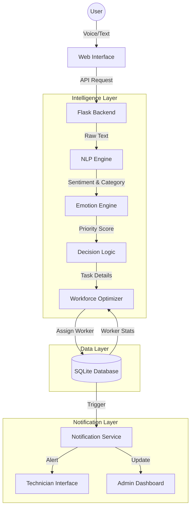

# System Architecture & Data Flow Design

## 1. High-Level Architecture Diagram
The system follows a **Event-Driven Modular Architecture**.

## 2. Module Descriptions

### A. User Interface (Client)
- **Web App**: Responsive HTML5/Bootstrap.
- **Voice Module**: JavaScript Web Speech API for dictation.
- **Function**: Captures user input, validates data, and displays real-time status.

### B. NLP & Emotion Engine (AI Analysis)
- **Input**: Raw complaint text.
- **Process**:
    1.  **Transcription**: Speech-to-Text (Browser-side).
    2.  **Sentiment Analysis**: `TextBlob` calculates Polarity (-1 to +1).
        *   *Example*: "I am furious about the broken fan!" -> Polarity -0.8 (High Urgency).
    3.  **Keyword Extraction**: Identifies resource (Fan, Light) and Location.

### C. Workforce Optimization Engine (Resource Allocation)
- **Input**: Complaint Category, Location, Priority.
- **Process**: Scores available workers.
    *   `Score = (Skill_Match * 0.5) + (Proximity * 0.3) + (1/Load * 0.2)`
- **Output**: ID of the optimal Technician.

### D. Database Schema (Data Layer)
1.  **Users**: Authentication & Roles (Student, Admin, *Technician*).
2.  **Workers**: Technician profiles (`skill`, `current_load`, `location`).
3.  **Complaints**: The central fact table linking Users, Workers, and Status.
4.  **Notifications**: Event logs for async alerts.

### E. Technician App (Service Side)
- **Role**: A simplified dashboard for workers.
- **Features**: "My Tasks", "Mark Complete", "Request Spare Parts".

## 3. Step-by-Step Data Flow

1.  **Submission**: User speaks "My room light is broken and it's urgent!"
2.  **Analysis**:
    *   NLP detects Category: `Electrical`.
    *   Emotion Engine detects Sentiment: `Negative` (-0.6).
    *   Logic combines "Urgent" keyword + Negative sentiment -> Sets Priority: **High**.
3.  **Assignment**:
    *   Optimizer looks for workers with Skill: `Electrical`.
    *   Finds `Worker A` (Load: 2) and `Worker B` (Load: 0).
    *   Assigns to **Worker B** (Higher Score due to low load).
4.  **Persistence**: Complaint saved to DB with `worker_id=B` and `status=Assigned`.
5.  **Notification**:
    *   System creates notification for Worker B: "New High Priority Task".
    *   Worker B sees task on their dashboard.
6.  **Resolution**: Worker B fixes light, marks `Resolved`. Sentiment feedback is requested from User.

## 4. Technology Stack
- **Frontend**: HTML5, Bootstrap 5, Vanilla JS (Voice).
- **Backend API**: Python Flask (RESTful).
- **AI/ML**: TextBlob (Sentiment), Custom Heuristics (Optimization).
- **Database**: SQLite (Development) / PostgreSQL (Production ready).

---
**Status**: Architecture Mapped. Database Schema Update Required.
